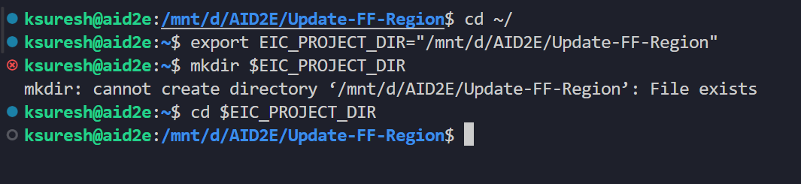
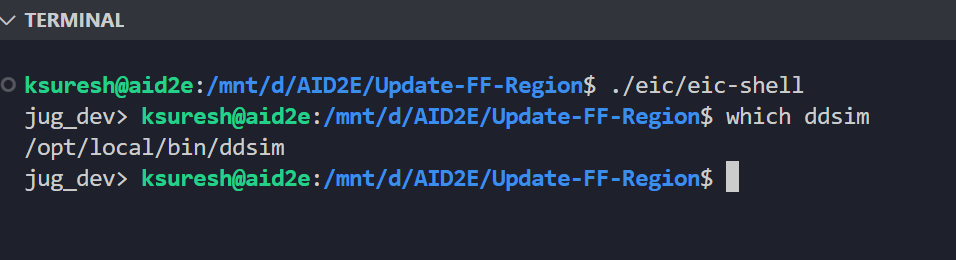
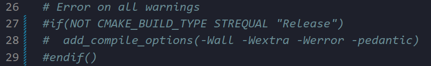
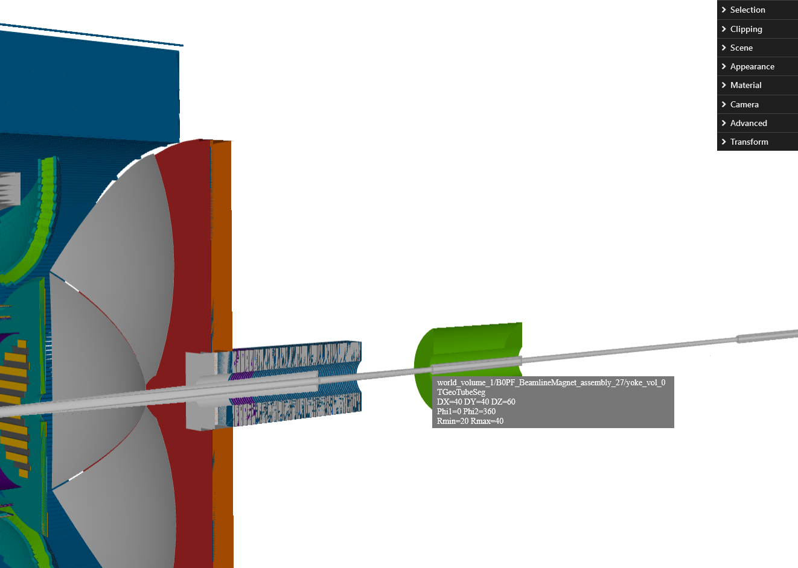
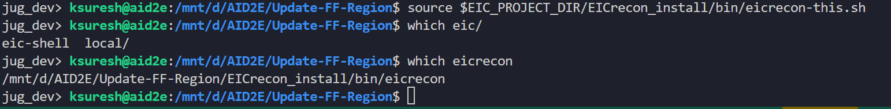
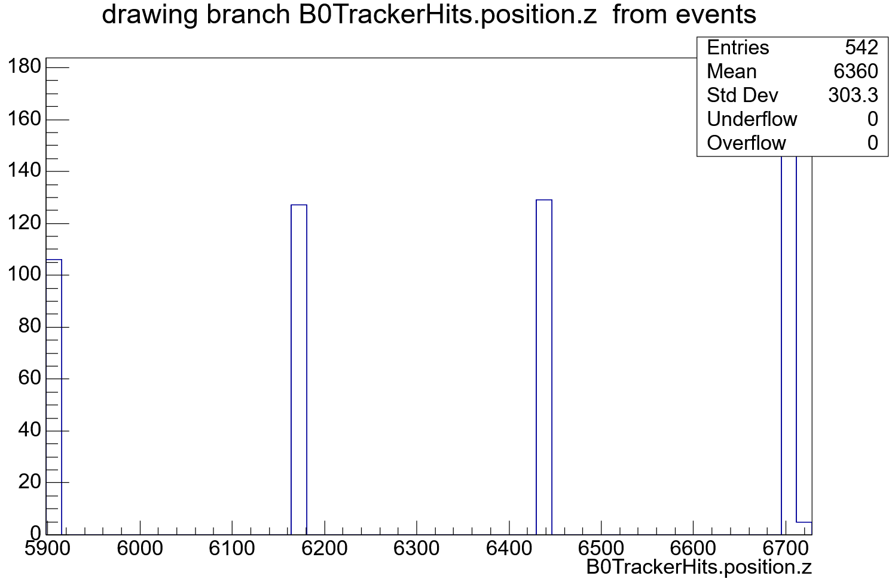
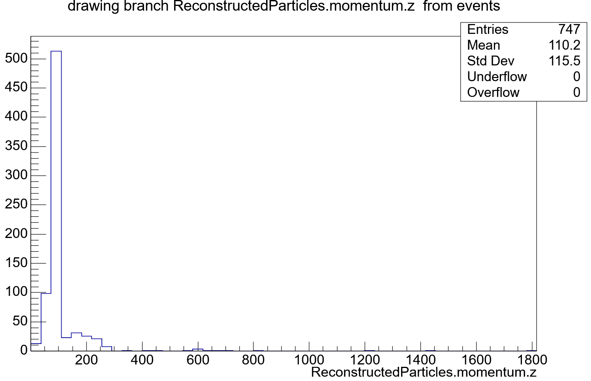
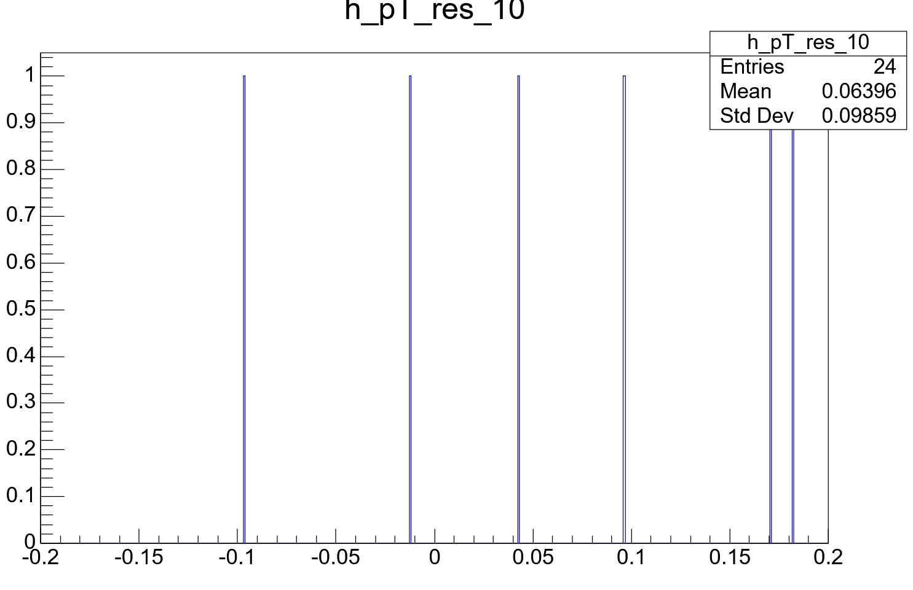
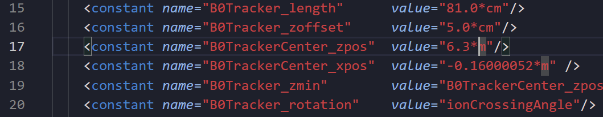
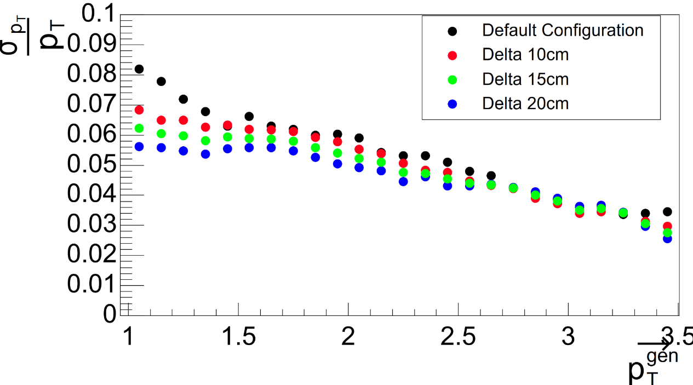

# Step by step Instructions to running EPIC EIC Far forward simulations

> [!NOTE]
> Working knowledge of `git`, linux terminal, basic `python` is expected to run the code.
> Minimal understanding and familiarity with EIC EPIC software framework is assumed.

I am assuming the the entire project is located under the directory in the environment variable `$EIC_PROJECT_DIR`. I have set mine as `export EIC_PROJECT_DIR="/mnt/d/AID2E/Update-FF-Region"`. Also I am using `bash` as my shell.

```
cd $EIC_PROJECT_DIR
```

This is the base working directory for the rest of the rest of the instructions. 

This is what I do in my terminal



## Cloning this repo

* I have my GitHub credentials lined in VSCode and I work within the VS code environemnt. Hence, I simply clone this repo. 
* If directly cloning on non VS code enviroment, Follow the steps in following github personal access tokens from [here](https://docs.github.com/en/authentication/keeping-your-account-and-data-secure/managing-your-personal-access-tokens)
* `cd $EIC_PROJECT_DIR`
* `git clone https://github.com/aid2e/B0_FarForward.git -b Step-by-step-intro`

## Installation of eic-shell 

* `cd $EIC_PROJECT_DIR`
* `mkdir eic`
* `curl -L https://github.com/eic/eic-shell/raw/main/install.sh | bash`
* `./eic/eic-shell`
* `which ddsim` -- This should output `/opt/local/bin/ddsim`

This is what I get 



## Installation of epic {#installation-of-epic}

* `cd $EIC_PROJECT_DIR`
* If not in eic-shell then `./eic/eic-shell`
* `git clone https://github.com/eic/epic.git -b b0-field-map-testing`
* `cd epic` -- then if you do `git branch` you should be on the branch `b0-field-map-testing`
* Because of recent updates to `epic`, it requires that all the compilations should have no warnings, else it throws in error during compilation. Hence, modify the file `CMakeLists.txt` and comment out the lines `27-29` (See the image below) 



* `cd $EIC_PROJECT_DIR`
* If not in eic-shell then `./eic/eic-shell`
* `mkdir epic_install epic_build`
* `cmake -B $EIC_PROJECT_DIR/epic_build -S $EIC_PROJECT_DIR/epic -DCMAKE_INSTALL_PREFIX=$EIC_PROJECT_DIR/epic_install`
* `cmake --build $EIC_PROJECT_DIR/epic_build -j8`
* `cmake --install $EIC_PROJECT_DIR/epic_build`
* `source $EIC_PROJECT_DIR/epic_install/setup.sh`
* `export DETECTOR="epic_craterlake_18x275" && export $DETECTOR_CONFIG="epic_craterlake_18x275"` -- This sets the correct epic detector geometry. This will be the detector geometry one has to use for Far Forward tasks.

> [!NOTE]
> **👷 TASK ⛑️** : Visualize the detector geometry and take a screenshot of the B0 Detector system. Make sure to point to the correct detector geometry. 
> When I do `dd_web_display $DETECTOR_PATH/${DETECTOR_CONFIG}.xml --export ${DETECTOR_CONFIG}.root` I get the following geometry and figure after zooming.



## Installation of EICrecon {#installation-of-eicrecon}

* `cd $EIC_PROJECT_DIR`
* If not in eic-shell then `./eic/eic-shell`
* `source $EIC_PROJECT_DIR/epic_install/setup.sh`
* `git clone https://github.com/eic/EICrecon.git`
* `cd EICrecon` -- then if you do `git branch` you should be on the branch `main`
* `git checkout v1.13.0` -- This is because of the issue raised here [#1500](https://github.com/eic/EICrecon/issues/1500)
* `mkdir EICrecon_build EICrecon_install`
* `cmake -B $EIC_PROJECT_DIR/EICrecon_build -S $EIC_PROJECT_DIR/EICrecon -DCMAKE_INSTALL_PREFIX=$EIC_PROJECT_DIR/EICrecon_install`
* `cmake --build $EIC_PROJECT_DIR/EICrecon_build -j8`
* `cmake --install $EIC_PROJECT_DIR/EICrecon_build`
* `source $EIC_PROJECT_DIR/EICrecon_install/bin/eicrecon-this.sh`
* when you do `which eicrecon` it should point to the one in EICrecon_install directory, Mine shows as 




## Running simulations of protons (out of the box)

Each time one has to source both `epic` and `EICrecon` and set the `$DETECTOR` and `$DETECTOR_CONFIG` before continuing 

* If not in eic-shell then `$EIC_PROJECT_DIR/eic/eic-shell`
* `source $EIC_PROJECT_DIR/epic_install/setup.sh`
* `export DETECTOR="epic_craterlake_18x275" && export $DETECTOR_CONFIG="epic_craterlake_18x275"`
* `source $EIC_PROJECT_DIR/EICrecon_install/bin/eicrecon-this.sh`
* `mkdir -p $EIC_PROJECT_DIR/Simulations`
* `cd $EIC_PROJECT_DIR/Simulations`
* `npsim --steeringFile $EIC_PROJECT_DIR/B0_FarForward/FromAlex/ddsim_steer_B0_testing.py --numberOfEvents 1000 --compactFile ${DETECTOR_PATH}/${DETECTOR_CONFIG}.xml --outputFile FarFowardSimulation.edm4hep.root > sim_log.out 2>sim_log.err` -- This uses a proton gun to throw protons with momentum $80-100~GeV$ between $0.006 - 0.012~rad$ in theta ($\theta$). The command should produce the file `FarFowardSimulation.edm4hep.root` with its associated logs `sim_log.out` and `sim_log.err`. These are the simulated level events before reconstruction. 
> [!NOTE]
> ** TASK ** : Open the root file and identify the B0 Tracker Hits and report back the plot for B0 Tracker Hits' z position (`position.z`). See the image below for what I get

* In order to reconstruct events, one has to use `eicrecon`. This is the command to use. `eicrecon -Pdd4hep:xml_files=${DETECTOR_PATH}/${DETECTOR_CONFIG}.xml -Ppodio_output_include_collections=ReconstructedParticles,GeneratedParticles,ReconstructedChargedParticles,BoTrackerRecHits -Pnthreads=8 FarFowardSimulation.edm4hep.root > recon_log.out 2>recon_log.err` -- This should produce `podio_output.root` file. This is the reconstructed level events.
> [!NOTE]
> ** TASK ** : Open the root file and identify ReconstructedChargedParticles under the events tree and look into 'z' momentum (momentum.z) and report back the plot. See the image below for what I get


> [!WARNING]
> If you dont see any particles, then it is possible that the error occured [here](https://github.com/eic/EICrecon/issues/1500) and you have to checkout the section [Adhoc fixing](#Adhoc-fixing) to fix it.
* `root -q -b '$EIC_PROJECT_DIR/B0_FarForward/SimpleAnalysis.C("podio_output.root")' > ana_log.out 2>ana_log.err` -- This analyses the reconstructed B0 tracks and computes the momentum resolution ($p = \sqrt{p_{x}^{2} + p_{y}^{2} + p_{z}^{2}}$) in bins of 1~GeV and transverse momentum resolution ($p_{T} = \sqrt{p_{x}^{2} + p_{y}^{2}}$) in bins of $0.1~GeV$. The output histograms are saved to a root file named `out.root`
> [!NOTE]
> ** TASK ** : Open the root file and identify the histograms and report back the histograms under the folder `pTResolutions`. There should be very few events since only 1000 tracks are generated. This is what I get 


* Fitting the histograms and extracting the perforamnce from the fit is done using `root -q -b '$EIC_PROJECT_DIR/B0_FarForward/PlotMomentum.C("out.root")' > fit_log.out 2>fit_log.err` -- This should produce `out-fit.root` and `out-fit*.pdf` files. This is the output of the fit. I have attached mine in the folder `sample_results`. 

* Now, average tracks to be simulated is of the order of few hunder thousands `O(100k)` tracks. Hence, having to simulate and reconstructed 100k tracks is very time consuming on a single CPU and would need to use distributed computing to do this. And running all these steps in an automated way is what the branch [Simulations](https://github.com/aid2e/B0_FarForward.git) do by running the single python file `RunSimulations.py`

## Running simulations with updated geometry

* In order to change the geometry of the B0 tracker, one has to change the modify the file `$DETECTOR_PATH/compact/far_forward/B0_tracker.xml`.
* B0 tracker is made of 4 layers of disk each of the disk is placed with a uniform inter layer distance of 27 cm and z-center of the disk is 630 cm.
* To change the z-center, modify the line 17 to `6.3*cm` to `6.1*cm`. Redo the simulation and analysis. 

* The plot shown below is made by moving the `z-center` to `6.3cm`, `6.4cm`, `6.45cm`, `6.5cm` with each design being simulated with 500k proton tracks. Check out updates and more info [here](https://docs.google.com/presentation/d/1bCKGQP6oY3mFkQFH7h8hN_vrfP3n-94vbKh-1YmtTo0/edit?usp=sharing)


# Adhoc fixing {#Adhoc-fixing}

* `cd $EIC_PROJECT_DIR`
* `mkdir Old_eic-shell`
* `cd Old_eic-shell`
* `singularity` has to be installed in order for this to work. If not install `singularity` by following [here](https://docs.sylabs.io/guides/3.0/user-guide/installation.html)
* `singularity pull --name eic-jug_xl-nightly-2024-03-12.sif docker://eicweb/jug_xl@sha256:213e55fb304a92eb5925130cdff9529ea55c570b21ded9ec24471aa9c61219d8`
* This should produce a file `eic-jug_xl-nightly-2024-03-12.sif`. Now modify the eic-shell script in `$EIC_PROJECT_DIR/eic/eic-shell` to use this image. So lets copy it over here first `cp $EIC_PROJECT_DIR/eic/eic-shell ./custom-eic-shell` 
* Replace the last line in `custom-eic-shell` by replacing the last line For me it is `${SIF:-/mnt/d/AID2E/Update-FF-Region/eic/local/lib/jug_xl-nightly.sif}` to `${SIF:-/mnt/d/AID2E/Update-FF-Region/Old_eic-shell/eic-jug_xl-nightly-2024-03-12.sif}`
* `$EIC_PROJECT_DIR/Old_eic-shell/custom-eic-shell`
* Recompile `epic` as in [Installation of epic](#installation-of-epic)
* Recompile `EICrecon` but with version tag `v1.11.0` and follow [Installation of EICrecon](#installation-of-eicrecon) (Again with the version tag `v1.11.0`)